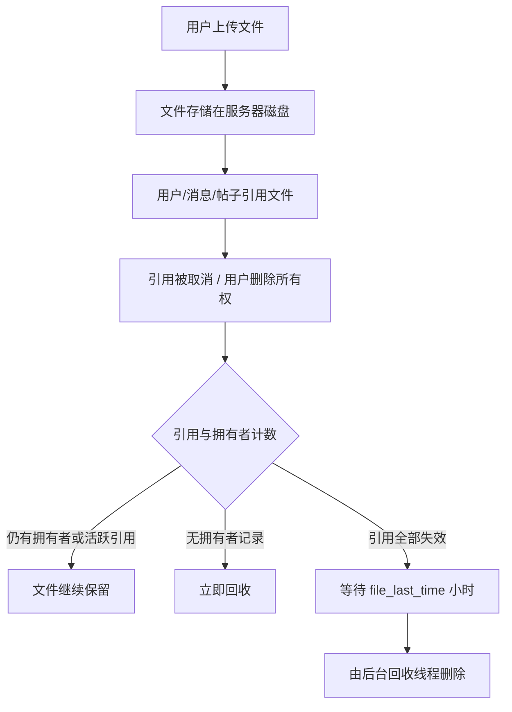

## 数据存储全景

### 数据库文件

| 文件 | 存储内容 | 关键表 |
|------|---------|--------|
| `db/user.db` | 用户账户、好友关系、JWT 会话 | `users`, `friendship`, `tokens` |
| `db/forum.db` | 论坛、帖子、附件、成员、帖内资源 | `forums`, `contents`, `post_attachments`, `forum_members`, `F<fid>` |
| `db/group.db` | 群组、成员、入群申请 | `groups`, `group_members`, `join_requests`, `group_id_sequence`, `schema_migrations` |
| `db/messages.db` | 私聊和群聊消息、房间偏好、@提及、群置顶 | `messages`, `room_preferences`, `message_mentions`, `group_pinned_messages` |
| `file/file.db` | 文件元数据、用户-文件关联、引用关系、分块上传任务 | `file`, `user_file`, `file_uploaders`, `file_references`, `file_gc`, `chunk_upload_tasks`, `chunk_upload_parts` |
| `db/notification.db` | 通知事件与元信息 | `notifications`, `notification_meta` |
| `db/sticker.db` | 表情包与表情资源 | `sticker_packs`, `stickers`, `user_sticker_packs`, `sticker_pack_creation_log`, `sticker_files` |

::: tip
SQLite 的 WAL 模式会生成 `-wal` 和 `-shm` 后缀的辅助文件，这是正常现象。不要在服务运行时手动删除它们。
:::

### JSON 文件

少量数据使用 JSON 文件存储：

| 文件 | 用途 | 线程安全 |
|------|------|---------|
| `config.json` | 服务器配置 | `threading.Lock` |
| `announcement.json` | 公告 | `threading.Lock` |
| `activate.json` | 邮箱验证码暂存（TMP） | `threading.Lock` |
| `forum/queue.json` | 论坛审批队列 | `threading.Lock` |
| `forum/comments.json` | 帖子评论 | `threading.Lock` |
| `captcha/captcha.json` | 验证码答案暂存（TMP） | `threading.Lock` |

### 文件存储

上传文件以 **SHA-256 哈希值** 命名存储在 `res/<port>/file/` 下，格式为 `<hash>.file`；表情包文件存放在 `res/<port>/sticker/` 下。

分块上传的临时分片位于 `res/<port>/tmp/`，上传完成或超时后由清理线程回收。

### 密钥文件

| 文件 | 用途 |
|------|------|
| `secret/pub.pem` | RSA 公钥，分发给客户端用于加密会话密钥 |
| `secret/pri.pem` | RSA 私钥，**必须严格保密** |
| `secret/jwt_secret` | JWT 签名密钥，首次启动自动生成 |

## 文件生命周期

文件从上传到清理的完整链路：



后台回收线程每 **60 秒**运行一次（配置变更每 5 分钟重新读取），可回收的文件必须满足以下任一条件：

1. `file_uploaders` 中已无该哈希的拥有者记录
2. `file_gc` 记录的“零引用时刻”已过去至少 **30 分钟**
3. `file_references` 中所有引用的最后引用时间早于 `file_last_time` 小时前

回收时会在哈希锁内**复核**资格，避免误删刚被重新登记的文件；`sticker` 目录下的表情资源由 `sticker.db` 全职管理，不参与自动删除。

::: tip 引用失效的常见场景
- 上传者删除自己引用的文件
- 消息撤回并不减少引用（root 仍可查看撤回原文），帖子删除、用户内容清理才会真正移除引用
- 管理员强制删除是例外，忽略所有引用计数
:::

## 验证码生命周期

- 验证码图片生成后有效期默认为 **300 秒**（5 分钟）
- 每次生成新验证码时会自动清理过期的验证码图片文件
- 验证码答案存储在 `captcha.json` 中，校验后不自动删除（超时自然失效）

## 对象存储（OSS2）

启用 OSS2 后，文件实体存放在云端，本地保留数据库元数据：

- 下载默认走 **307 预签名直链**（`file_download_mode: redirect`），字节不经过 TFS；可切换为 `proxy` 由服务端中转
- 服务端在回收文件时会尝试删除对象，但**不保证有权限**，建议在存储桶配置生命周期规则兜底
- 本地临时文件与超时的分块上传任务每 **10 分钟**清理一次

## 数据库维护

### 日常运行

SQLite + WAL 模式在日常运行中基本无需人工干预。

值得注意的是：

- **写入量**：消息表 (`messages`) 写入最为频繁，每条消息一行。数据库文件会随使用持续增长
- **WAL 文件大小**：WAL 文件在 checkpoint 后会被回收。SQLite 默认自动 checkpoint（WAL 达到 1000 页时）
- **索引**：消息表有多个索引（conversation、receiver、group、client_mid），确保查询效率
- **请注意，SQLite WAL 模式下，直接复制 `.db` 文件可能得到不一致的状态**

### 维护

- **VACUUM**（可选）：回收数据库文件空间
  ```bash
  sqlite3 res/<port>/db/messages.db "VACUUM;"
  ```
- **完整性检查**（可选）：可在服务运行时执行
  ```bash
  sqlite3 res/<port>/db/user.db "PRAGMA integrity_check;"
  ```

::: warning
VACUUM 会锁定数据库并重建文件，耗时与数据量成正比。务必在停服后执行。
:::

## 备份策略

### 备份内容

| 优先级 | 内容 | 路径 | 说明 |
|--------|------|------|------|
| 最高 | 所有 `.db` 文件 | `res/<port>/db/` 与 `res/<port>/file/file.db` | 核心数据 |
| 最高 | RSA 密钥与 JWT 密钥 | `res/<port>/secret/` | 丢失后所有已注册用户无法登录 / token 全部失效 |
| 高 | 上传文件 | `res/<port>/file/` | 用户数据（OSS2 模式下在云端） |
| 高 | 表情包文件 | `res/<port>/sticker/` | 用户资源 |
| 高 | 头像文件 | `res/<port>/avatar/` | 用户/论坛/群组头像 |
| 中 | 配置文件 | `res/<port>/config.json` | 可手动重建但费时 |
| 中 | 公告数据 | `res/<port>/announcement.json` | |
| 低 | 论坛审批队列 | `res/<port>/forum/queue.json` | |
| 低 | 评论数据 | `res/<port>/forum/comments.json` | |
| 低 | 验证码/激活码 | `res/<port>/captcha/`, `activate.json` | TMP 数据 |

### 在线备份

SQLite WAL 模式支持在线备份。可以尝试使用 SQLite 的 `backup` API：

```bash
sqlite3 res/<port>/db/user.db "VACUUM INTO 'backup/user.db';"
```

对所有 `.db` 文件（含 `file/file.db`）执行上述命令即可获得一致性的在线备份。

### 离线备份

停服后直接复制整个 `res/<port>/` 目录即可：

```bash
cp -r res/<port>/ backup_$(date +%Y%m%d)/
```

::: danger
不要在服务运行时直接复制 `.db` 文件（除非使用 `VACUUM INTO`）。WAL 模式下直接复制可能得到不一致的状态。
:::

## RSA 密钥管理

### 密钥的作用

RSA-2048 密钥对是加密体系的核心：
- **公钥** (`pub.pem`)：客户端下载后用于加密 AES 会话密钥。可公开分发
- **私钥** (`pri.pem`)：服务端解密会话密钥。**必须严格保密**

### 密钥检查

服务器创建时会提供哈希验证，请在可能的情况下要求客户端尝试验证。TouchFish Client 支持保存并校验服务器密钥，密钥变更时会向用户告警。

### 更换密钥对

私钥丢失或需要更换：
```python
from crypto import generate_rsa_keys
pri, pub, pri_pem, pub_pem, sha256_hash = generate_rsa_keys()
# 将 pri_pem 写入 res/<port>/secret/pri.pem
# 将 pub_pem 写入 res/<port>/secret/pub.pem
# 将 sha256_hash 公布给用户
```

::: warning
更换密钥后，旧公钥加密的历史将无法解密。
:::

### JWT 签名密钥

`res/<port>/secret/jwt_secret` 在首次需要签发 token 时自动生成。删除或替换该文件并重启服务器，可一次性使**全部用户**的 token 失效（相当于强制全员重新登录）。日常运维中请将其与 RSA 私钥同等对待。

## 升级指南

### 同版本配置更新

修改 `config.json` 后重启服务即可（或通过 root API 运行时热更新，详见[开服指导](/guide/server-setup)）。

### 代码升级

```bash
git pull
pip install -r requirements.txt
# 检查是否有数据库迁移需求（查看 db/group.py 中的 schema_migrations）
python main.py --start-api --use-config <编号>
```

### 数据库迁移

项目包含部分智能迁移逻辑（参见 `db/group.py` 中的 `schema_migrations` 表）。启动时自动检测并执行未应用的迁移。一般情况下无需手动干预。

启动时还会执行两项数据一致性维护：

- 根据有效用户所有权、聊天消息与论坛附件**重新校准**文件的 `upload_user_count` 与 `ref_count`
- 回填历史数据中缺失的文件大小（OSS2 模式下向对象存储查询，本地模式下读取磁盘）

但自动迁移不是万能的，复杂的迁移可能需要人工干预。**请务必在升级前备份数据库。因迁移错误而损坏数据库将无法恢复。**

### 版本回退

数据库不保证向前兼容，因此不推荐尝试回退版本。

无论 TFS 还是 TFC 都不建议回退版本。
