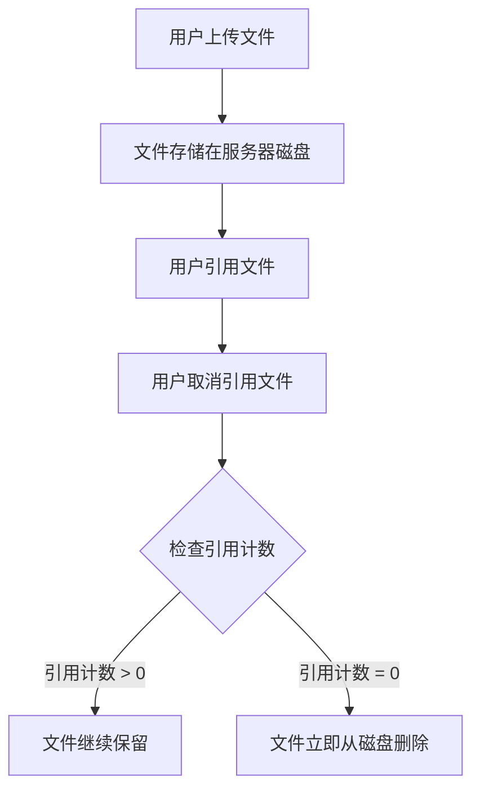

## 数据存储全景

### 数据库文件

| 文件 | 存储内容 | 关键表 |
|------|---------|--------|
| `user.db` | 用户账户、好友关系 | `users`, `friendship` |
| `forum.db` | 论坛、帖子、成员、论坛内消息 | `forums`, `contents`, `forum_members`, `F<fid>` |
| `group.db` | 群组、成员、入群申请 | `groups`, `group_members`, `join_requests` |
| `messages.db` | 私聊和群聊消息 | `messages` |
| `file.db` | 文件元数据、用户-文件关联 | `file`, `user_file` |
| `notification.db` | 用户通知事件 | `U<uid>` |

::: tip
SQLite 的 WAL 模式会生成 `-wal` 和 `-shm` 后缀的辅助文件，这是正常现象。不要在服务运行时手动删除它们。
:::

### JSON 文件

少量数据使用 JSON 文件存储：

| 文件 | 用途 | 线程安全 |
|------|------|---------|
| `config.json` | 服务器配置 | `threading.Lock` |
| `announcement.json` | 公告 | `threading.Lock` |
| `activate.json` | 邮箱验证码暂存（TMP） | `threading.Lock` |
| `forum/queue.json` | 论坛审批队列 | `threading.Lock` |
| `forum/comments.json` | 帖子评论 | `threading.Lock` |
| `captcha/captcha.json` | 验证码答案暂存（TMP） | `threading.Lock` |

### 文件存储

上传文件以 **SHA-256 哈希值** 命名存储在 `res/<port>/file/` 下，格式为 `<hash>.file`。

## 文件生命周期

文件从上传到清理的完整链路：



::: tip 引用计数归零的常见场景
- 上传者删除自己引用的文件
- 管理员强制删除文件
- 用户账号被清理时，其所有文件引用一并移除
:::

清理触发时机：每次上传文件、取消引用、或删除文件操作时，系统会调用 `lose_effect()` 检查并清理所有超时的无效文件。

## 验证码生命周期

- 验证码图片生成后有效期默认为 **300 秒**（5 分钟）
- 每次生成新验证码时会自动清理过期的验证码图片文件
- 验证码答案存储在 `captcha.json` 中，校验后不自动删除（超时自然失效）

## 数据库维护

### 日常运行

SQLite + WAL 模式在日常运行中基本无需人工干预。

值得注意的是：

- **写入量**：消息表 (`messages`) 写入最为频繁，每条消息一行。数据库文件会随使用持续增长
- **WAL 文件大小**：WAL 文件在 checkpoint 后会被回收。SQLite 默认自动 checkpoint（WAL 达到 1000 页时）
- **索引**：消息表有多个索引（conversation、receiver、group、client_mid），确保查询效率
- **请注意，SQLite WAL 模式下，直接复制 `.db` 文件可能得到不一致的状态**

### 维护

- **VACUUM**（可选）：回收数据库文件空间
  ```bash
  sqlite3 res/<port>/db/messages.db "VACUUM;"
  ```
- **完整性检查**（可选）：可在服务运行时执行
  ```bash
  sqlite3 res/<port>/db/user.db "PRAGMA integrity_check;"
  ```

::: warning
VACUUM 会锁定数据库并重建文件，耗时与数据量成正比。务必在停服后执行。
:::

## 备份策略

### 备份内容

| 优先级 | 内容 | 路径 | 说明 |
|--------|------|------|------|
| 最高 | 所有 `.db` 文件 | `res/<port>/db/` | 核心数据 |
| 最高 | RSA 私钥 | `res/<port>/secret/pri.pem` | 丢失后所有已注册用户无法登录 |
| 高 | 上传文件 | `res/<port>/file/` | 用户数据 |
| 高 | 头像文件 | `res/<port>/avatar/` | 用户/论坛/群组头像 |
| 中 | 配置文件 | `res/<port>/config.json` | 可手动重建但费时 |
| 中 | 公告数据 | `res/<port>/announcement.json` | |
| 低 | 论坛审批队列 | `res/<port>/forum/queue.json` | |
| 低 | 评论数据 | `res/<port>/forum/comments.json` | |
| 低 | 验证码/激活码 | `res/<port>/captcha/`, `activate.json` | TMP 数据 |

### 在线备份

SQLite WAL 模式支持在线备份。可以尝试使用 SQLite 的 `backup` API：

```bash
sqlite3 res/<port>/db/user.db "VACUUM INTO 'backup/user.db';"
```

对所有 `.db` 文件执行上述命令即可获得一致性的在线备份。

### 离线备份

停服后直接复制整个 `res/<port>/` 目录即可：

```bash
cp -r res/<port>/ backup_$(date +%Y%m%d)/
```

::: danger
不要在服务运行时直接复制 `.db` 文件（除非使用 `VACUUM INTO`）。WAL 模式下直接复制可能得到不一致的状态。
:::

## RSA 密钥管理

### 密钥的作用

RSA-2048 密钥对是加密体系的核心：
- **公钥** (`pub.pem`)：客户端下载后用于加密 AES 会话密钥。可公开分发
- **私钥** (`pri.pem`)：服务端解密会话密钥。**必须严格保密**

### 密钥检查

服务器创建时会提供哈希验证，请在可能的情况下要求客户端尝试验证。


### 更换密钥对

私钥丢失或需要更换：
```python
from crypto import generate_rsa_keys
pri, pub, pri_pem, pub_pem, sha256_hash = generate_rsa_keys()
# 将 pri_pem 写入 res/<port>/secret/pri.pem
# 将 pub_pem 写入 res/<port>/secret/pub.pem
# 将 sha256_hash 公布给用户
```

::: warning
更换密钥后，旧公钥加密的历史将无法解密。
:::


## 升级指南

### 同版本配置更新

修改 `config.json` 后重启服务即可（或通过 root API 运行时热更新）。

### 代码升级

```bash
git pull
pip install -r requirements.txt
# 检查是否有数据库迁移需求（查看 db/group.py 中的 schema_migrations）
python main.py --start-api --use-config <编号>
```

### 数据库迁移

项目包含部分智能迁移逻辑（参见 `db/group.py` 中的 `schema_migrations` 表）。启动时自动检测并执行未应用的迁移。一般情况下无需手动干预。

但自动迁移不是万能的，复杂的迁移可能需要人工干预。**请务必在升级前备份数据库。因迁移错误而损坏数据库将无法恢复。**

### 版本回退

数据库不保证向前兼容，因此不推荐尝试回退版本。
